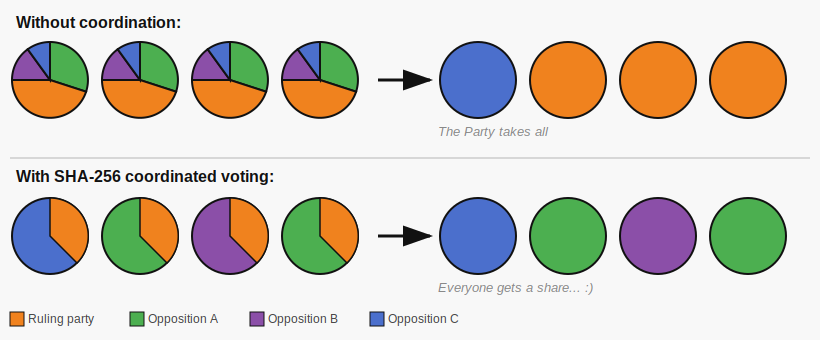

# FPTP Protest Voting

> *"All for change, change for all — a voter coordination pact"*

**A single HTML file that helps voters in First-Past-the-Post democracies coordinate tactically — without agreeing on anything except the method.**

---

## The problem in one paragraph

In FPTP systems, the candidate with the most votes wins each constituency — not a majority, just a plurality. When three or four opposition candidates split the vote, a ruling party candidate can win with 30–35% of the vote. Multiplied across hundreds of constituencies, this produces governments that most voters did not choose. And once in power, a rational government has every incentive to keep the opposition fragmented: culture wars, identity politics, and structural rules that make coordination harder with every election cycle.

---

## The breakthrough: constitutional continuity

Every other response to this problem — protests, boycotts, radical movements — operates *outside* the system, which gives the system's defenders something to push back against. A protest can be dispersed. A boycott can be ignored. An emigrant is gone.

**This tool works entirely inside the existing rules.** It uses the ballot box — the system's own mechanism — to correct the system's own distortion. There is nothing to ban. There is no one to arrest. There is no argument about legitimacy, because voters are simply voting.

This is change through constitutional continuity. It is radical in effect and conservative in method.

---

## How it works

The tool asks for three inputs:

1. **Constituency number** — publicly available before any election
2. **Opposition candidates and their approximate popularity** — previous election results work fine; rough estimates are enough
3. **A seed: the opening value of the country's main stock exchange index on the Monday morning before the election** — published in every newspaper, announced on every radio station, available without internet access, and controlled by nobody

From these, it computes a single recommendation using a cryptographic hash:

```
winner = max( SHA-256( constituency | candidate_name | salt_i | index_value ) )
         for each candidate, repeated [popularity] times
```

More popular candidates have more "lottery tickets" — a higher probability of winning — but the result is not deterministic until the index value is known. Once known, it's the same for everyone, everywhere, and independently verifiable.



---

## Key properties

| Property | Detail |
|----------|--------|
| **No ideology required** | Voters who agree on nothing except their dissatisfaction can use it together |
| **Lawful and unassailable** | Works inside the electoral system using its own rules |
| **Self-activating** | Spreads when genuinely needed; dormant otherwise |
| **Self-correcting** | Can be turned against any entrenched government, including a future one that disappoints |
| **Probabilistically fair** | Smaller parties retain a real chance; not just winner-takes-all |
| **Independently verifiable** | Anyone can reproduce the result with `echo -n "..." \| sha256sum` |
| **Offline and untraceable** | Single HTML file; no server, no account, no network required |
| **Statistically robust** | Doesn't require universal adoption — only a critical mass per constituency |

---

## Verification

The result can be verified by anyone, independently, without this tool:

```bash
echo -n "CONSTITUENCY|CANDIDATE_NAME|BEST_SALT|INDEX_VALUE" | sha256sum
```

If a different version of this tool produces a different result for the same inputs, **it is provably tampered with.** This is the defence against fake forks: mathematical transparency makes central trust unnecessary.

> ⚠️ **Warning for forks:** The hash as well as the order of fields in the hash input (`constituency|candidate|salt|index`) must never be changed. A fork that reorders the fields produces different results and is incompatible — and indistinguishable from a deliberate attempt to split coordination. The oldest, most widely circulated version of this tool is the canonical reference.

---

## Files

| File | Description |
|------|-------------|
| `all41and14all_voting.html` | The coordination tool — open in any browser, works offline |
| `fptp_landing_blog.html` | Long-form explainer / landing page for non-technical readers |

---

## Where this applies

Any democracy using FPTP or a mixed system with FPTP constituencies:

**Full FPTP:** United Kingdom, India, Canada, USA, Bangladesh, Nigeria, Ghana, Pakistan, Jamaica, and others — approximately **1.5 billion voters**

**Mixed (FPTP constituencies + proportional lists):** Hungary, Germany, Japan, South Korea, Mexico, and others — several hundred million more

Not applicable in proportional systems (Netherlands, Scandinavia) or two-round systems (France), where the coordination problem is handled differently by the electoral architecture itself.

---

## The self-correction mechanism

The tool has no loyalty to any side. If the coalition that wins through this method eventually becomes complacent or self-serving, it too becomes "the entrenched minority government" — and the same method can be used against it. No rupture required. The next election comes, the same tool applies, the outcome corrects.

This is not a tool for the left or the right. It is a tool for the outvoted.

---

## Usage

1. Download `all41and14all_voting.html`
2. Open it in any browser — no internet required
3. Enter your constituency number, the opposition candidates with rough popularity estimates, and the stock exchange index value from the Monday morning before election day
4. Follow the recommendation
5. Share the file — over Bluetooth, USB, QR code, Signal, anything

---

## Licence

MIT — free to use, study, modify, and distribute. The only informal constraint: if you fork this, **do not change the hash and its input format.** Doing so silently fragments coordination in a way that is technically indistinguishable from a deliberate attack on the tool's purpose.

---

## Background

This project emerged from a conversation about the structural mechanics of FPTP systems — why they systematically reward fragmentation, how incumbents exploit that mathematically, and why every traditional response (coalitions, protests, boycotts) has failed to solve the underlying coordination problem. The tool is the result of asking: what is the minimum intervention that breaks the coordination failure, requires no trust between parties, and operates entirely within the law?

The answer turned out to be a 200-line HTML file.
